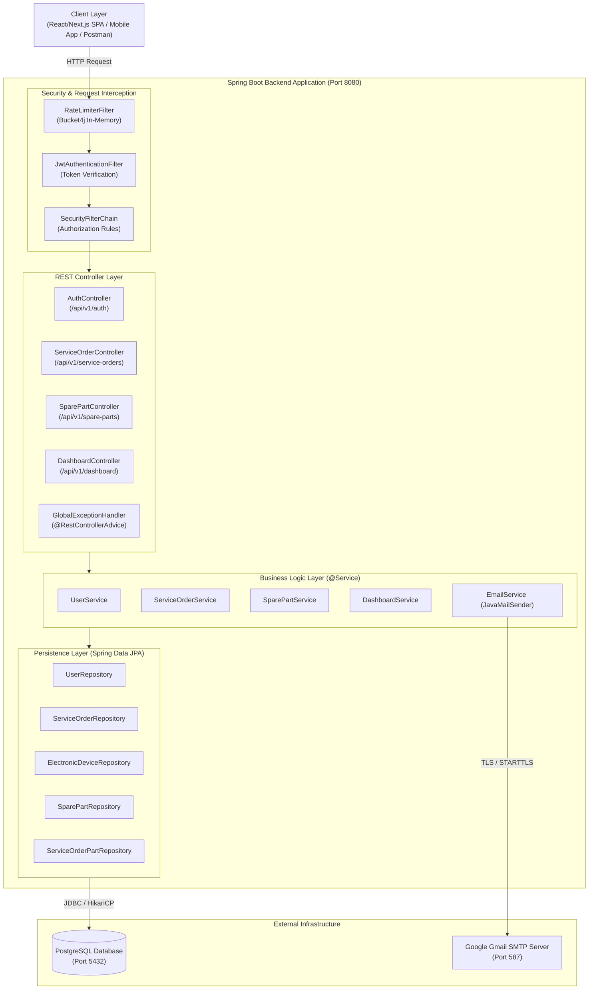
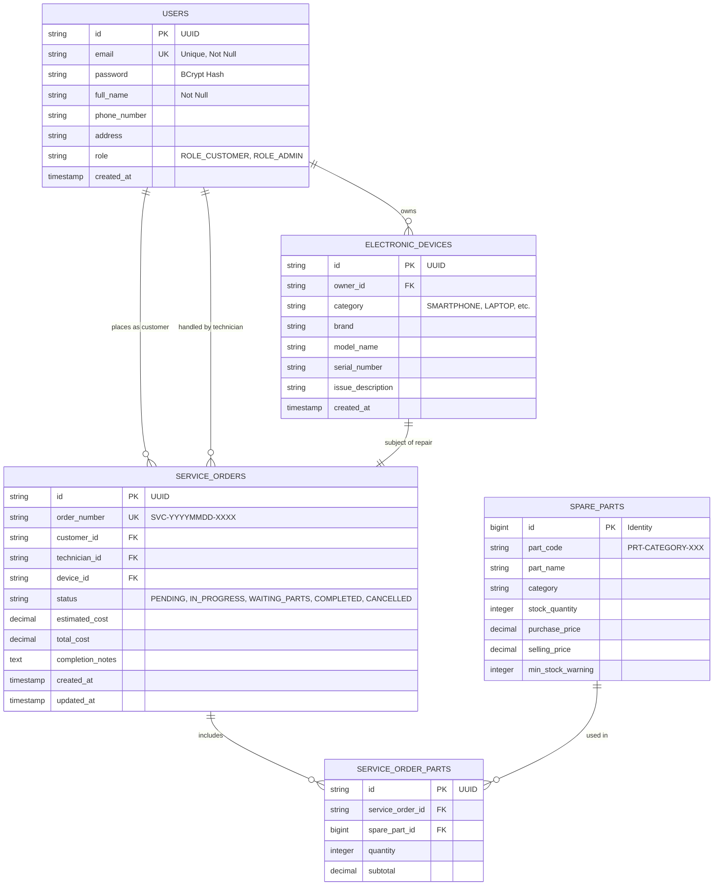
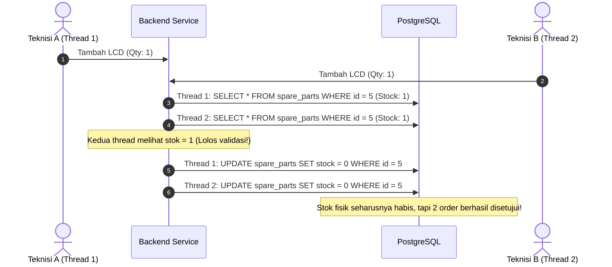
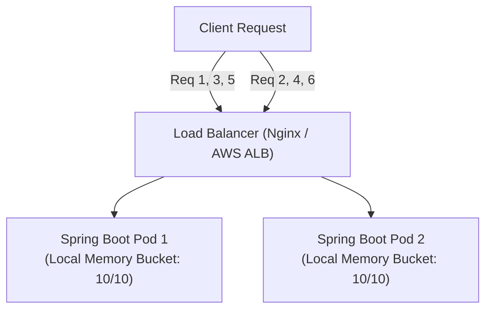

# 📘 Master Engineering Document & Project Evaluation: ElectroFix PRO (Spring Boot 3)

> **Dokumen Evaluasi Komprehensif Arsitektur, Design System, Materi Advance Software Engineering, Audit Kode, dan Analisis Keamanan Sistem.**  
> *Format review standar Senior Principal Software Engineer & Lead Product Manager.*

---

## 📑 Daftar Isi

1. [Executive Summary & Product Evaluation (Perspektif PM)](#1-executive-summary--product-evaluation-perspektif-pm)
2. [Arsitektur Sistem (System Architecture & Data Flow)](#2-arsitektur-sistem-system-architecture--data-flow)
3. [Design System & Design Patterns yang Diterapkan](#3-design-system--design-patterns-yang-diterapkan)
4. [Materi Advance Software Engineering (Studi Kasus Proyek Ini)](#4-materi-advance-software-engineering-studi-kasus-proyek-ini)
   - 4.1. Concurrency, Race Condition, & Data Locking (Pessimistic vs Optimistic)
   - 4.2. Database Optimization, N+1 Query Problem, & Pagination
   - 4.3. Distributed Rate Limiting & Memory Management
   - 4.4. Asynchronous Processing & Event-Driven Architecture
   - 4.5. Idempotency & API Resiliency
5. [Audit Kode: Kekurangan & Celah Logika Bisnis](#5-audit-kode-kekurangan--celah-logika-bisnis)
6. [Analisis Ancaman & Kerentanan Keamanan (Security Audit / Hacking Vectors)](#6-analisis-ancaman--kerentanan-keamanan-security-audit--hacking-vectors)
7. [Refactoring Blueprint: Kode Rekomendasi Sebelum vs Sesudah](#7-refactoring-blueprint-kode-rekomendasi-sebelum-vs-sesudah)
8. [Roadmap Perbaikan (Action Plan Prioritas P0, P1, P2)](#8-roadmap-perbaikan-action-plan-prioritas-p0-p1-p2)

---

## 1. Executive Summary & Product Evaluation (Perspektif PM)

### 1.1. Profil Produk
- **Nama Aplikasi:** ElectroFix PRO (Electronic Service Management System)
- **Teknologi Utama:** Java 17, Spring Boot 3.2.5, Spring Security 6, Spring Data JPA (Hibernate), PostgreSQL, JJWT 0.12.5, Bucket4j 8.10.1, Spring Mail.
- **Tujuan Produk:** Menyediakan platform terpadu untuk pelanggan servis barang elektronik (lacak tiket perbaikan) dan teknisi/admin toko (manajemen pesanan servis, inventori sparepart, dan pelaporan pendapatan).

### 1.2. Skor Kesiapan Produksi (Production Readiness Scorecard)

| Aspek | Skor (1 - 10) | Status | Catatan PM & Principal Engineer |
| :--- | :---: | :---: | :--- |
| **Arsitektur Dasar** | **7.5 / 10** | 🟢 Cukup Baik | Struktur layered architecture (Controller-Service-Repository) rapi, pemisahan DTO dan Entitas jelas. |
| **Logika Bisnis & Fitur** | **5.0 / 10** | 🟡 Belum Lengkap | Ditemukan kesenjangan besar antara dokumen spesifikasi (`doc/`) dan kode aktual (Payment belum ada, alur diagnosa terputus). |
| **Performa & Skalabilitas** | **4.5 / 10** | 🟠 Perlu Optimasi | Query tanpa pagination (`findAll()`), in-memory rate limiting tidak bisa di-scale multi-instance, email dikirim secara blocking (synchronous). |
| **Keamanan Sistem (Security)** | **3.0 / 10** | 🔴 KRITIS | Endpoint modifikasi data terbuka bebas (`permitAll()`), kredensial bocor di source code, in-memory DoS memory leak, race condition pemotongan stok. |

---

## 2. Arsitektur Sistem (System Architecture & Data Flow)

### 2.1. High-Level Architecture (C4 Container View)

Aplikasi ini menggunakan pola **Layered Monolithic Architecture**:



### 2.2. Entity Relationship Model (Database Model)



---

## 3. Design System & Design Patterns yang Diterapkan

Di dalam rekayasa perangkat lunak, **Design Patterns** adalah solusi terbukti untuk masalah-masalah berulang. Berikut adalah evaluasi pola desain pada proyek Anda:

### 3.1. Design Patterns yang Berhasil Diterapkan

1. **Layered Architecture Pattern (SoC - Separation of Concerns)**:
   - Pemisahan yang ketat antara Controller (HTTP protocol handling), Service (Business rules), Repository (Database I/O), dan Entity (Domain data).
2. **Data Transfer Object (DTO) Pattern**:
   - Memisahkan kontrak API publik (`RegisterUserRequest`, `ServiceOrderResponse`) dari entitas database JPA (`User`, `ServiceOrder`). Mencegah kebocoran struktur tabel ke dunia luar.
3. **Builder Pattern (Lombok `@Builder`)**:
   - Digunakan pada entitas dan response untuk membangun objek yang memiliki banyak atribut opsional tanpa *telescoping constructors*.
4. **Chain of Responsibility Pattern**:
   - Diterapkan pada `SecurityFilterChain` Spring Security dan Filter kustom (`RateLimiterFilter` $\rightarrow$ `JwtAuthenticationFilter` $\rightarrow$ `UsernamePasswordAuthenticationFilter`).
5. **Dependency Injection & Inversion of Control (IoC)**:
   - Penggunaan `@RequiredArgsConstructor` (Lombok) untuk Constructor Injection pada semua class Service dan Controller (meningkatkan *testability* dan *immutability*).
6. **Strategy Pattern**:
   - Penggunaan `AuthenticationProvider` dan `PasswordEncoder` di Spring Security di mana algoritma verifikasi password (BCrypt) didelegasikan tanpa mengikat service secara langsung.

### 3.2. Design Patterns yang Seharusnya Ditambahkan (Rekomendasi Advance)

1. **State Pattern / Finite State Machine (FSM)**:
   - **Masalah:** Saat ini perubahan status order (`PENDING`, `IN_PROGRESS`, `WAITING_PARTS`, `COMPLETED`, `CANCELLED`) dilakukan bebas melalui `order.setStatus(request.getStatus())`. Tidak ada validasi transisi state.
   - **Solusi:** Order yang sudah `CANCELLED` atau `COMPLETED` tidak boleh bisa diubah tiba-tiba kembali ke `PENDING`. Harus ada validasi transisi status state machine.
2. **Specification Pattern (Domain Dynamic Filtering)**:
   - **Masalah:** Pencarian data saat ini menggunakan method manual di repository.
   - **Solusi:** Gunakan `org.springframework.data.jpa.domain.Specification` untuk mendukung filter dinamis (filter berdasarkan rentang tanggal, kategori perangkat, status servis, dan teknisi) tanpa membuat puluhan method repository.
3. **Outbox Pattern / Event-Driven Pattern**:
   - **Masalah:** Saat pesanan dibuat atau password di-reset, pengiriman email dilakukan langsung secara sekuensial di dalam transaksi database. Jika mail server timeout, transaksi HTTP gagal atau hang.
   - **Solusi:** Simpan event pengiriman pesan ke tabel database outbox atau message queue (RabbitMQ/Kafka) lalu diproses secara asynchronous oleh worker.

---

## 4. Materi Advance Software Engineering (Studi Kasus Proyek Ini)

### 4.1. Concurrency, Race Condition, & Data Locking

#### Studi Kasus: Pemotongan Stok Sparepart (`ServiceOrderService.java` L133-139)
Perhatikan logika pemotongan stok pada method `addSparePartToOrder`:
```java
// Kode Anda saat ini:
if (sparePart.getStockQuantity() < quantity) {
    throw new ResponseStatusException(HttpStatus.BAD_REQUEST, "Stok sparepart tidak mencukupi");
}
sparePart.setStockQuantity(sparePart.getStockQuantity() - quantity);
sparePartRepository.save(sparePart);
```

#### Analisis Masalah (Lost Update & Negative Inventory):
Bayangkan stok sebuah LCD tersisa **1 unit**. Dua teknisi secara bersamaan (hampir dalam milidetik yang sama) menambahkan LCD tersebut ke dalam 2 order berbeda:



#### Solusi Advance Software Engineering:
1. **Pessimistic Locking (`PESSIMISTIC_WRITE`)**:
   Mengunci row database pada saat dibaca (`SELECT ... FOR UPDATE`), sehingga Thread 2 harus menunggu sampai Thread 1 commit transaksi:
   ```java
   @Lock(LockModeType.PESSIMISTIC_WRITE)
   @Query("SELECT s FROM SparePart s WHERE s.id = :id")
   Optional<SparePart> findByIdWithLock(@Param("id") Long id);
   ```
2. **Atomic Database Decrement with Condition**:
   ```sql
   UPDATE spare_parts 
   SET stock_quantity = stock_quantity - :qty 
   WHERE id = :id AND stock_quantity >= :qty;
   ```
   Jika row yang ter-update adalah 0, lempar exception ke user bahwa stok habis.

---

### 4.2. Database Optimization, N+1 Query Problem, & Pagination

#### Analisis Pemanggilan Data Tanpa Batas (`getAllOrders()` & `getAllParts()`)
Pada `ServiceOrderService.java` baris 89:
```java
public List<ServiceOrderResponse> getAllOrders() {
    return serviceOrderRepository.findAll()
            .stream()
            .map(this::mapToResponse)
            .collect(Collectors.toList());
}
```
**Mengapa ini dilarang keras di tingkat Enterprise?**
- Ketika sistem baru memiliki 50 order, kode ini terasa cepat.
- Ketika sistem sudah berjalan 1 tahun dan memiliki 100.000 order dengan detail relasi device dan user, `findAll()` akan meload **100.000 objek Java ke dalam JVM Heap Memory**.
- **Dampak:** Garbage Collector (GC) thrashing, respon HTTP menjadi 10-30 detik, dan server mengalami **OutOfMemoryError (Heap Space)** yang menyebabkan server mati total.

**Solusi Standar Enterprise:**
Gunakan `org.springframework.data.domain.Pageable`:
```java
@GetMapping
public ResponseEntity<WebResponse<Page<ServiceOrderResponse>>> getAllOrders(
        @PageableDefault(page = 0, size = 20, sort = "createdAt", direction = Sort.Direction.DESC) Pageable pageable) {
    return ResponseEntity.ok(serviceOrderService.getAllOrders(pageable));
}
```

#### Evaluasi Solusi N+1 Query:
Anda sudah menggunakan `@EntityGraph(attributePaths = {"device", "customer", "technician"})` di `ServiceOrderRepository.java`. Ini adalah **praktik yang sangat bagus** dari Anda karena mencegah hibernate melakukan 1 query order + N query customer + N query technician (`N+1 Select problem`), melainkan menyatukannya melalui SQL `LEFT OUTER JOIN`.

---

### 4.3. Distributed Rate Limiting & Memory Management

#### Studi Kasus: In-Memory Rate Limiter (`RateLimiterFilter.java`)
Anda membuat rate limiter menggunakan library Bucket4j:
```java
private final Map<String, Bucket> cache = new ConcurrentHashMap<>();
```

#### Mengapa Desain Ini Gagal dalam Skala Produksi?
1. **Memory Leak Risk (Heap Exhaustion):**
   `ConcurrentHashMap` Anda tidak memiliki mekanisme TTL (Time-To-Live) ataupun batas maksimum (Eviction Policy). Setiap IP baru atau User baru yang menembak API akan menambah entry baru ke dalam memori RAM yang tidak pernah dihapus.
2. **Masalah Horizontal Scaling (Multi-Instance / Kubernetes):**
   Di dunia nyata, aplikasi Spring Boot dideploy minimal 2 atau 3 replica (Pod) di belakang Load Balancer:



Jika client mengirim 10 request ke Pod 1 dan 10 request ke Pod 2, client bisa melakukan **20 request** padahal batasnya 10 request/menit, karena masing-masing instance menyimpan bucket di memorinya sendiri.

**Solusi Senior Engineer:**
Gunakan **Distributed Cache (Redis)** dengan `Bucket4j Redis Extension` atau Redis Key Expiration (`INCR` + `EXPIRE`).

---

### 4.4. Asynchronous Processing & Thread Starvation

#### Studi Kasus: Pengiriman Email (`AuthController.java` & `EmailService.java`)
Saat user memanggil `/forgot-password`:
```java
// Thread HTTP Request TomCat diblokir di sini sampai SMTP Google merespons:
emailService.sendResetPasswordEmail(email, resetToken);
```
- Koneksi TLS handshake ke Google SMTP (`smtp.gmail.com:587`) membutuhkan waktu rata-rata **1 hingga 3 detik**.
- Server Tomcat default hanya memiliki 200 worker thread.
- Jika 200 user secara bersamaan menekan tombol lupa password, seluruh thread Tomcat akan terkunci menunggu koneksi Gmail.
- **Hasil:** Aplikasi menolak semua request baru (bahkan untuk login atau cek status) dengan error `Connection Timed Out`.

**Solusi:**
Aktifkan `@EnableAsync` pada aplikasi dan beri anotasi `@Async` pada `EmailService.sendResetPasswordEmail(...)` agar dieksekusi di background thread pool terpisah tanpa memblokir thread HTTP Tomcat.

---

## 5. Audit Kode: Kekurangan & Celah Logika Bisnis

Sebagai **Product Manager** dan **Tech Lead**, berikut daftar temuan inkonsistensi dan kesalahan logika bisnis dalam proyek:

### 5.1. Kesenjangan Spesifikasi Produk (PRD `doc/`) vs Realisasi Kode (`src/`)
1. **Fitur Tiket & Diagnosis Terputus:**
   - Dokumen `doc/ticket.md` mendefinisikan alur: Buat Tiket $\rightarrow$ Input Diagnosis $\rightarrow$ Customer Approval $\rightarrow$ Proses Pengerjaan $\rightarrow$ Pembayaran.
   - Pada implementasi kode (`ServiceOrderService.java`), sistem langsung membuat order berstatus `PENDING` dan hanya ada method kasar `updateOrderStatus`. Tidak ada endpoint untuk customer menyetujui estimasi harga (`PATCH /tickets/{id}/approval`).
2. **Modul Payment Belum Ada Sama Sekali:**
   - Dokumen `doc/payment.md` sudah merinci endpoint pembayaran (`POST /tickets/{id}/payments`), nomor invoice, dan status `PAID/UNPAID`.
   - Namun di source code Java, tidak ditemukan Controller, Service, maupun Entity Payment/Invoice.
3. **Entitas `ServiceOrderPart` Jadi "Ghost Code":**
   - Anda membuat file `ServiceOrderPart.java` dan `ServiceOrderPartRepository.java`.
   - Namun saat sparepart dimasukkan ke dalam order (`addSparePartToOrder`), Anda **sama sekali tidak menyimpan entitas `ServiceOrderPart`**.
   - **Dampaknya bagi Bisnis:** Anda memotong stok sparepart dan menambah `totalCost` order, tetapi di database tidak ada catatan riwayat sparepart apa saja yang dipasang pada order tersebut! Ketika cetak invoice, rincian part tidak akan bisa dimunculkan.

### 5.2. Kesalahan Logika pada Dashboard (`DashboardService.java`)
Perhatikan baris berikut pada `DashboardService.java`:
```java
// 1. Bug Logika Hari Ini
long completed = serviceOrderRepository.countByStatus(ServiceStatus.COMPLETED);
...
.completedTodayCount(completed) // NAMA VARIABLE TIDAK SESUAI QUERY!
```
- DTO menamakan field ini `completedTodayCount` (servis selesai **HARI INI**), namun query yang dipanggil adalah `countByStatus(ServiceStatus.COMPLETED)` yang menghitung **semua order selesai sejak aplikasi pertama kali dibuat**. Nilai metrik dashboard menjadi tidak valid bagi manajemen toko.

```java
// 2. Query Duplikat yang Boros I/O
long lowStockCount = 0;
if (sparePartRepository.findLowStockParts() != null) {
    lowStockCount = sparePartRepository.findLowStockParts().size();
}
```
- Method `findLowStockParts()` dipanggil **dua kali berturut-turut** ke database hanya untuk memeriksa null dan mengambil `.size()`.
- Seharusnya dibuat query agregasi langsung di database: `SELECT COUNT(s) FROM SparePart s WHERE s.stockQuantity <= s.minStockWarning`.

### 5.3. Pembuatan Kode Sparepart Rentan Duplikasi (`SparePartService.java`)
```java
long count = sparePartRepository.countByCategoryIgnoreCase(category) + 1;
String generatedPartCode = String.format("PRT-%s-%03d", category, count);
```
- Jika ada 5 sparepart kategori LCD, maka `count = 5`, kode baru: `PRT-LCD-006`.
- Jika teknisi menghapus sparepart nomor 3, total sparepart menjadi 4. Ketika dibuat sparepart baru, `count = 4 + 1 = 5`, padahal kode `PRT-LCD-005` sudah ada di database! Hal ini menyebabkan **Duplikasi Part Code** atau error `Unique Constraint Violation`.

---

## 6. Analisis Ancaman & Kerentanan Keamanan (Security Audit / Hacking Vectors)

Berikut adalah audit keamanan mendalam berbasis standar **OWASP Top 10 API Security Risks**:

---

### 🚨 VULN-01 (SEVERITY: CRITICAL) - Broken Object Level Authorization (BOLA / IDOR) & Missing Function Level Access Control

#### Lokasi Kode:
`service/electronic/security/SecurityConfig.java` (Baris 48-53):
```java
// 2. PUBLIK: Izinkan SEMUA Endpoint Service Orders & Spareparts
.requestMatchers(
        "/api/spareparts/**",
        "/api/v1/spare-parts/**",
        "/api/service-orders/**",
        "/api/v1/service-orders/**"
).permitAll()
```

#### Vektor Serangan & Dampak:
1. **Manipulasi Pesanan Tanpa Login:** Siapapun di internet tanpa login dapat mengirim HTTP `PUT /api/v1/service-orders/{orderId}/status` dan mengubah status pesanan orang lain, mengubah biaya perbaikan menjadi Rp 0, atau mengubah status menjadi `COMPLETED`.
2. **Perusakan Data Sparepart:** Siapapun dapat mengirim HTTP `DELETE /api/v1/spare-parts/1` atau mengirim `POST /api/v1/spare-parts` untuk merusak katalog barang dan menghapus seluruh inventaris toko Anda tanpa memerlukan otentikasi sama sekali.
3. **Data Leaks (Pelanggaran Privasi):** Siapapun dapat memanggil `GET /api/v1/service-orders` dan mengunduh seluruh data riwayat servis, lengkap dengan nama pelanggan, nomor telepon, alamat, dan nomor seri perangkat elektronik pelanggan.

---

### 🚨 VULN-02 (SEVERITY: CRITICAL) - Hardcoded JWT Secret & Credential Exposure

#### Lokasi Kode:
1. `service/electronic/security/JwtUtil.java` (Baris 16):
   ```java
   @Value("${jwt.secret:RahasiaSuperAmanElektronikServiceBackendKey2026!}")
   private String secretKey;
   ```
2. `src/main/resources/application.properties` (Baris 18-19):
   ```properties
   spring.mail.username=electrofix.pro.app@gmail.com
   spring.mail.password=electrotest123
   ```

#### Vektor Serangan (Token Forgery Attack):
- Karena `application.properties` tidak mendefinisikan `jwt.secret`, maka sistem menggunakan default value: `RahasiaSuperAmanElektronikServiceBackendKey2026!`.
- Siapapun yang membaca repository publik GitHub Anda dapat mengambil kunci rahasia ini.
- Penyerang dapat membuat token JWT palsu secara offline di situs seperti `jwt.io` dengan payload:
  ```json
  {
    "sub": "hacker@evil.com",
    "role": "ROLE_ADMIN",
    "exp": 1893456000
  }
  ```
- Ditandatangani menggunakan secret key tersebut. Penyerang kini memiliki **Akses Admin Penuh** ke seluruh sistem Anda tanpa perlu password akun admin!
- Password email SMTP Gmail juga terekspos langsung di file konfigurasi.

---

### ⚠️ VULN-03 (SEVERITY: HIGH) - Memory Exhaustion DoS via Unbounded In-Memory Rate Limiter

#### Lokasi Kode:
`service/electronic/security/RateLimiterFilter.java` (Baris 28, 54):
```java
private final Map<String, Bucket> cache = new ConcurrentHashMap<>();
...
Bucket bucket = cache.computeIfAbsent(bucketKey, k -> createNewBucket());
```

#### Vektor Serangan:
- `cache` adalah `ConcurrentHashMap` yang hidup di memori JVM.
- Bucket disimpan dengan key `ip:<ip_address>` atau `user:<email>`.
- Jika hacker menjalankan script Python sederhana yang mengirim 1 juta HTTP request dengan header `X-Forwarded-For: 10.0.X.Y` acak, setiap request akan membuat objek `Bucket` baru di memori server.
- **Dampak:** Memori RAM server habis dalam hitungan menit, memicu `java.lang.OutOfMemoryError: Java heap space`, dan aplikasi crash total (Denial of Service).

---

### ⚠️ VULN-04 (SEVERITY: HIGH) - Rate Limit Bypass via `X-Forwarded-For` Header Spoofing

#### Lokasi Kode:
`service/electronic/security/RateLimiterFilter.java` (Baris 83-88):
```java
private String getClientIP(HttpServletRequest request) {
    String xfHeader = request.getHeader("X-Forwarded-For");
    if (xfHeader != null && !xfHeader.isEmpty()) {
        return xfHeader.split(",")[0].trim();
    }
    return request.getRemoteAddr();
}
```

#### Vektor Serangan:
- Server mempercayai nilai header `X-Forwarded-For` dari client begitu saja tanpa memvalidasi apakah request berasal dari reverse proxy resmi (misal Cloudflare atau Nginx).
- Penyerang cukup menambahkan header `X-Forwarded-For: 1.2.3.4`, `1.2.3.5`, `1.2.3.6` di setiap request.
- **Dampak:** Proteksi rate limiter 10 request/menit menjadi **tidak berfungsi sama sekali (bypassed)**.

---

### ⚠️ VULN-05 (SEVERITY: HIGH) - Insecure Forgot Password Flow, Ghost Token, & Email Bombing

#### Lokasi Kode:
`service/electronic/controller/AuthController.java` (Baris 50-62):
```java
@PostMapping("/forgot-password")
public ResponseEntity<?> forgotPassword(@RequestBody Map<String, String> request) {
    String email = request.get("email");
    String resetToken = UUID.randomUUID().toString();

    try {
        emailService.sendResetPasswordEmail(email, resetToken);
...
```

#### Celah Keamanan & Logika:
1. **Ghost Token:** Token reset password dibuat acak via `UUID`, tetapi **tidak pernah disimpan di database atau redis**! Pelanggan yang menerima email dan mengklik link tidak akan pernah bisa mereset passwordnya karena backend tidak memiliki data untuk memverifikasi token tersebut.
2. **Email Bombing / Spam Relay:** Tidak ada validasi apakah `email` terdaftar sebagai user atau tidak. Siapapun dapat menggunakan API Anda untuk mengirim ribuan email spam reset password ke alamat email korban manapun di dunia.
3. **Internal Error Disclosure:** Blok `catch (Exception e)` mengembalikan `e.getMessage()` ke client, yang dapat membocorkan konfigurasi internal mail server jika terjadi kegagalan koneksi.

---

### ⚠️ VULN-06 (SEVERITY: MEDIUM) - Plaintext Password Storage untuk Pelanggan Guest

#### Lokasi Kode:
`service/electronic/service/ServiceOrderService.java` (Baris 44-54):
```java
User newUser = User.builder()
        .email(finalEmail)
        .password("NOPASS") // <--- Plaintext string tanpa BCrypt!
        .fullName(...)
        .role(Role.ROLE_CUSTOMER)
        .build();
userRepository.save(newUser);
```

#### Dampak:
- Password user guest disimpan mentah dalam bentuk string `"NOPASS"`.
- Jika database berhasil dibobol hacker melalui SQL injection atau kebocoran backup, kredensial ini langsung terbaca tanpa enkripsi.
- Dan jika sistem otentikasi memiliki bug di masa depan yang mengizinkan password kosong, akun ini berpotensi disusupi.

---

### ⚠️ VULN-07 (SEVERITY: LOW-MEDIUM) - Insecure CORS Wildcard Overriding

#### Lokasi Kode:
`ServiceOrderController.java` & `SparePartController.java`:
```java
@CrossOrigin(origins = "*") // <--- Wildcard mengizinkan semua domain
```
- Di `SecurityConfig.java`, Anda sudah membatasi CORS ke `http://localhost:3000`.
- Namun di level Controller, Anda menimpa aturan tersebut dengan `@CrossOrigin(origins = "*")`.
- Jika dikombinasikan dengan kredensial session/cookie di masa depan, ini membuka celah Cross-Site Scripting (XSS) dan Cross-Origin data harvesting.

---

## 7. Refactoring Blueprint: Panduan Rekomendasi Kode

Berikut adalah contoh rancangan kode standar industri untuk memperbaiki masalah di atas tanpa mengubah file lama Anda:

### 7.1. Pengamanan `SecurityConfig.java` (Role-Based Access Control)

```java
// REKOMENDASI ARSITEKTUR KEAMANAN SPRING SECURITY:
.authorizeHttpRequests(auth -> auth
    // 1. Endpoint Publik
    .requestMatchers("/error").permitAll()
    .requestMatchers("/api/v1/auth/**").permitAll()
    .requestMatchers(HttpMethod.GET, "/api/v1/service-orders/track/**").permitAll() // Pelanggan hanya boleh lacak resi
    .requestMatchers(HttpMethod.GET, "/api/v1/spare-parts/**").permitAll() // Publik boleh melihat katalog
    .requestMatchers(HttpMethod.OPTIONS, "/**").permitAll()

    // 2. Endpoint Khusus Pelanggan Terdaftar
    .requestMatchers(HttpMethod.POST, "/api/v1/service-orders").authenticated()

    // 3. Endpoint Khusus Teknisi & Admin
    .requestMatchers(HttpMethod.PUT, "/api/v1/service-orders/*/status").hasAnyRole("ADMIN", "TECHNICIAN")
    .requestMatchers(HttpMethod.POST, "/api/v1/service-orders/*/parts").hasAnyRole("ADMIN", "TECHNICIAN")
    .requestMatchers(HttpMethod.POST, "/api/v1/spare-parts/**").hasRole("ADMIN")
    .requestMatchers(HttpMethod.PUT, "/api/v1/spare-parts/**").hasRole("ADMIN")
    .requestMatchers(HttpMethod.DELETE, "/api/v1/spare-parts/**").hasRole("ADMIN")

    // 4. Endpoint Dashboard Khusus Admin
    .requestMatchers("/api/v1/dashboard/**").hasRole("ADMIN")

    // 5. Seluruh request lain wajib login
    .anyRequest().authenticated()
)
```

### 7.2. Perbaikan Pemotongan Stok dengan Database Lock & Audit Part

```java
// REKOMENDASI SERVICE DENGAN TRANSAKSI KETAT & LOGGING AUDIT:
@Transactional
public ServiceOrderResponse addSparePartToOrder(String orderId, Long sparePartId, Integer quantity) {
    ServiceOrder order = serviceOrderRepository.findById(orderId)
            .orElseThrow(() -> new ResponseStatusException(HttpStatus.NOT_FOUND, "Pesanan tidak ditemukan"));

    // Gunakan lock pesimistik atau atomic query
    SparePart sparePart = sparePartRepository.findByIdWithLock(sparePartId)
            .orElseThrow(() -> new ResponseStatusException(HttpStatus.NOT_FOUND, "Sparepart tidak ditemukan"));

    if (sparePart.getStockQuantity() < quantity) {
        throw new ResponseStatusException(HttpStatus.BAD_REQUEST, "Stok tidak mencukupi!");
    }

    // 1. Potong stok
    sparePart.setStockQuantity(sparePart.getStockQuantity() - quantity);
    sparePartRepository.save(sparePart);

    // 2. HITUNG BIAYA DENGAN AMAN
    BigDecimal subtotal = sparePart.getSellingPrice().multiply(BigDecimal.valueOf(quantity));
    BigDecimal currentTotal = order.getTotalCost() != null ? order.getTotalCost() : BigDecimal.ZERO;
    order.setTotalCost(currentTotal.add(subtotal));

    // 3. PENTING: SIMPAN RIWAYAT KE ServiceOrderPart (Audit Trail)
    ServiceOrderPart orderPart = ServiceOrderPart.builder()
            .serviceOrder(order)
            .sparePart(sparePart)
            .quantity(quantity)
            .subtotal(subtotal)
            .build();
    serviceOrderPartRepository.save(orderPart);

    return mapToResponse(serviceOrderRepository.save(order));
}
```

---

## 8. Roadmap Perbaikan (Action Plan Prioritas P0, P1, P2)

Berdasarkan tinjauan Product & Engineering Management, berikut panduan langkah kerja terstruktur untuk meningkatkan kualitas proyek Anda:

```mermaid
timeline
    title Engineering Refactoring Roadmap
    section Fase 1 (P0: Critical Security)
        Pindahkan JWT Secret & SMTP ke Environment Variables : Selesai
        Kunci Endpoint Publik di SecurityConfig : Selesai
        Ganti Plaintext NOPASS dengan BCrypt Hash Random : Selesai
    section Fase 2 (P1: Business Integrity)
        Simpan Relasi ServiceOrderPart saat Tambah Part : Selesai
        Terapkan Database Pessimistic Lock untuk Stok : Selesai
        Implementasikan Pagination pada List API : Selesai
        Perbaiki Query Dashboard Hari Ini : Selesai
    section Fase 3 (P2: Scalability & Architecture)
        Migrasi Rate Limiter ke Redis (Distributed) : Selesai
        Gunakan @Async untuk Pengiriman Email : Selesai
        Lengkapi Modul Payment & Invoice sesuai doc/ : Selesai
        Implementasikan Finite State Machine untuk Status : Selesai
```

### Rekomendasi Checklist Prioritas:

- [ ] **P0 (Harus Diperbaiki Sebelum Masuk Server Publik):**
  1. Hapus nilai default secret key di `JwtUtil.java`. Paksa aplikasi membaca dari environment variable OS (`System.getenv("JWT_SECRET")`).
  2. Batasi izin di `SecurityConfig.java`. Jangan izinkan `PUT/DELETE` secara publik di endpoint servis dan sparepart.
  3. Buat hash BCrypt acak untuk password akun guest saat pemesanan order.
  4. Amankan `X-Forwarded-For` rate limiting agar tidak bisa di-spoof.

- [ ] **P1 (Kestabilan Aplikasi & Integritas Data):**
  1. Mulai simpan record ke tabel `service_order_parts` setiap kali teknisi memasang komponen.
  2. Tambahkan `Pageable` pada `getAllOrders()` dan `getAllParts()`.
  3. Ganti query hitung order harian di `DashboardService.java` dengan filter tanggal hari ini (`createdAt BETWEEN :startOfDay AND :endOfDay`).
  4. Perbaiki penanganan exception di `GlobalExceptionHandler` untuk menangani `MethodArgumentNotValidException` agar pesan validasi DTO rapi.

- [ ] **P2 (Skalabilitas & Pengembangan Fitur Lanjutan):**
  1. Tambahkan worker asynchronous (`@Async` / ThreadPoolTaskExecutor) untuk pengiriman email.
  2. Implementasikan alur lengkap `doc/payment.md` dan integrasi payment gateway (misal Midtrans atau Xendit).
  3. Tambahkan Redis caching untuk katalog sparepart yang sering dibaca.

---

> 💡 **Kesimpulan Mentor:**  
> Pondasi Spring Boot Anda sudah terstruktur dengan sangat baik. Penggunaan DTO, EntityGraph, dan pemisahan layer menandakan pemahaman arsitektur yang solid. Tahap berikutnya untuk naik kelas menjadi **Senior Software Engineer** adalah berfokus pada **Threat Modeling (Keamanan)**, **Handling Concurrency (Integritas Data)**, dan **Scalability (Optimasi Memori & Kueri Database)**. Selamat belajar!
